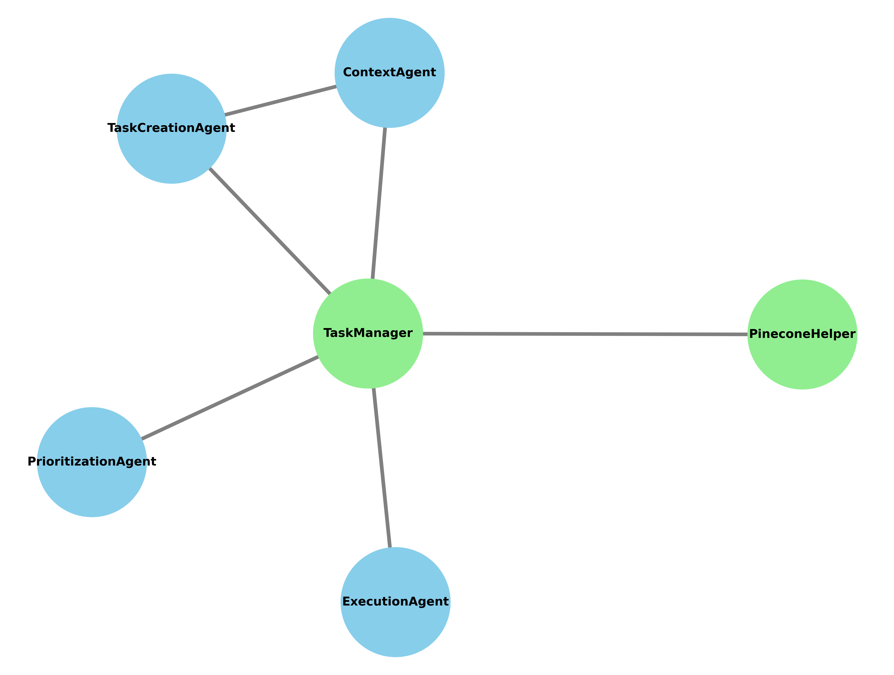

# Otto: Autonomous Collective Decision Maker (ACDM)

Otto wraps a large language model and a vector database, serving as the initial stage of a digital organization designed to be self-governing, autonomous, and capable of changing scale. The primary goal is to enable agents to collaboratively manage resources, make decisions, and govern themselves. Design decisions encompass autonomous processes that ensure all agents have an equal say in the direction and management of the organization.

In its current form, Otto is an AI-driven system that manages tasks, executes them, generates new tasks, and reprioritizes the task list. It utilizes OpenAI for natural language understanding, Pinecone for task-result storage, and embeddings for context retrieval. The project may be deprecated at any moment. All credit goes to @OpenAI and @yoheinakajima.

## Features

The project comprises the following components:

* agents: Contains various agent classes responsible for different aspects of task management, such as context, execution, prioritization, and task creation.
* pinecone_helper: Provides helper functions to interact with the Pinecone vector database.
* task_manager: Manages tasks and their interactions with agents.
* utils: Contains utility functions, such as embedding and visualization.
* interactions: Stores interaction data between tasks and agents.
* configs: Contains configuration files, such as config.yaml.
* requirements.txt: Lists the project's Python dependencies.
* scripts: Contains the main.py script to run the project.
* .github: Stores the GitHub-related configurations and workflows
* LICENSE: Contains the project's license information.

## Agent Interaction Diagram

## Installation & Usage

1. Install the required packages: pip install -r requirements.txt
2. Rename `config_copy.yaml`to`config.yaml`, set your OpenAI and Pinecone API keys in the `OPENAI_API_KEY` and `PINECONE_API_KEY` variables.
3. Set the Pinecone environment in the `PINECONE_ENVIRONMENT` variable.
4. Set the name of the table where the task results will be stored in the `TABLE_NAME` variable.
5. Set the first task of the system in the `FIRST_TASK` variable.
6. In root directory, run the script: python scripts/main.py

## Support

For support, please raise an issue on the project's GitHub repository or contact the maintainers via email.

## Roadmap

_TODO: List planned features, improvements, or fixes for future releases._

## Contributing

Contributions are welcome! Please read the contributing guidelines before submitting a pull request or opening an issue.

## Authors and Acknowledgment

All credit goes to @yoheinakajima as the work is built on first commit of BABYAGI project

## License

This project is licensed under the MIT License. See the [LICENSE](LICENSE) file for details.

## Project Status

This project is under active development. If you'd like to become a maintainer or contribute to the project, please get in touch with the current maintainers.
