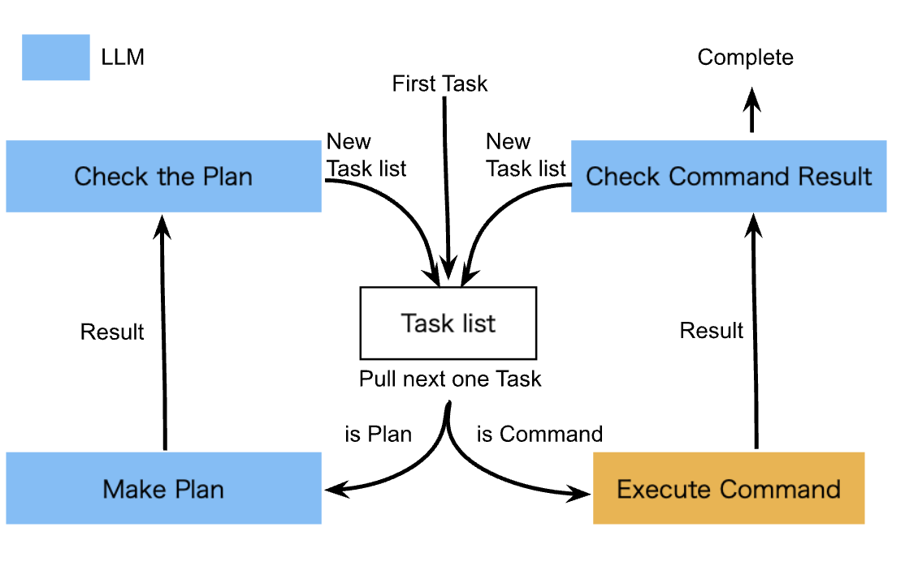

# Precautions

- There is a risk of inadvertently damaging the environment. Please execute primarily in a virtual environment such as Docker.
- The objective may not be achieved and it may continue to loop. The amount of API usage may increase in such cases, so please use responsibly.
- It is recommended to use GPT-4 or higher as it has been mainly verified with GPT-4 or higher.

# Objective

This Python script is an example of a system in which AI executes commands while planning. This system uses OpenAI's GPT-4 or higher to plan task creation and command execution. The main idea of this system is to see what happens when you combine the ability of AI to plan, like [BabyAGI](https://github.com/yoheinakajima/babyagi), with the CLI, a computer interaction system older than GUI. The idea comes from the possibility that LLM may be compatible with CLI. The part that was the thinking part of [BabyAGI](https://github.com/yoheinakajima/babyagi) has been greatly simplified for efficient command execution. (We may change this in the future)

# Mechanism

This script works by executing the following continuous loop:

1. Retrieve the first task from the task list.
2. Determine if that task is a command task or a planning task.
3. If it's a command task:
    1. Execute the command.
    2. If the command execution result has a Status Code of 0 and no response:
        Proceed to the next task.
    3. Otherwise:
        Analyze the result of the command execution with LLM, check if the objective is complete, and if not, create a new task list.
4. If it's a planning task:
    1. Execute the plan with LLM.
    2. Analyze the executed plan with LLM and create a new task list.



# Setup

Please follow the steps below:

1. ```git clone https://github.com/saten-private/BabyCommandAGI.git```
2. Enter the BabyCommandAGI directory with ```cd```.
3. Create a file to insert environment variables with ```cp .env.example .env```.
4. Set the OpenAI key to OPENAI_API_KEY.
5. Set the name of the table where the task results are saved to the TABLE_NAME variable.
6. (Optional) Set the objective of the task management system to the OBJECTIVE variable.
7. (Optional) Set the system's first task to the INITIAL_TASK variable.

# Execution (Docker)

As a prerequisite, docker and docker-compose must be installed. Docker desktop is the simplest option https://www.docker.com/products/docker-desktop/

Please execute the following:

```
docker-compose up
```

# Contributing

BabyCommandAGI is still in the early stages, determining its direction and the steps to get there. Currently, BabyCommandAGI is aiming for simplicity. To maintain this simplicity, when submitting PRs, we kindly ask you to follow the guidelines below:

- Focus on small, modularized fixes rather than large-scale refactoring.
- When introducing new features, provide a detailed explanation of the corresponding specific use cases.

Note from @saten-private (May 21, 2023):

I am not used to contributing to open source. I work another job during the day and I don't know if I can check PRs and issues frequently. However, I cherish this idea and hope it will be useful for everyone. Please feel free to let me know if there's anything. I am looking forward to learning a lot from you all.
I am a novice, I cannot speak English, and I hardly understand cultures outside of Japan. However, I cherish my ideas, and I hope they will be of use to many people.
(I'm sure I will continue to come up with many boring ideas in the future)
