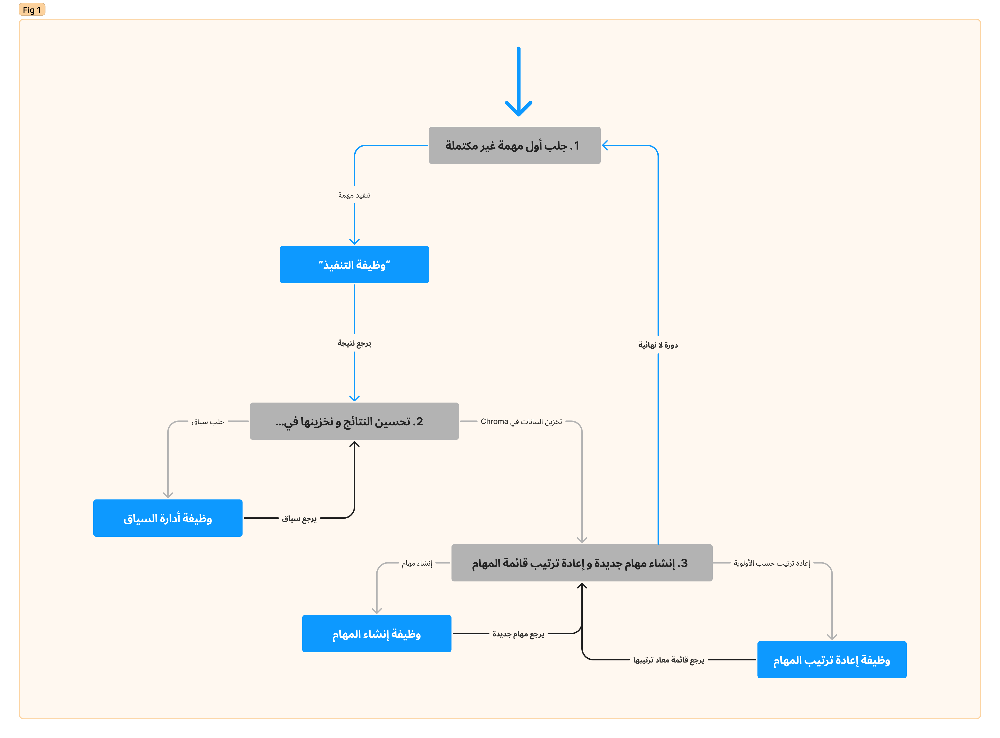

<style>
   * {
      direction: rtl;
   }
</style>

<h1 align="center">
BabyAGI
</h1>
<h5 align="center">(ذكاء عام اصطناعي صغير)</h5>

# الهدف

هذا البرنامج يعتبر مثال تطبيقي لنظام إدارة مهام يعمل بواسطة الذكاء الاصطناعي. يستخدم النظام OpenAI و Chroma DB لإنشاء وترتيب المهام حسب الأولوية و ثم تنفيذها. الفكرة الرئيسية هي إنشاء مهام Tasks جديدة بناءً على هدف محدد مسبقاً بمساعدة الذكاء الاصطناعي -تحديداً، قدرات المعالجة اللغوية التي تقدمها النماذج التوليدية المدربة مسبقاً GPTs- من OpanAI وتخزين هذه المهام و نتائجها في قاعدة بيانات Chroma لاسترجاعها لاحقاً حسب السياق. هذه نسخة مختصرة من المقترح الأصلي [Task-Driven Autonomous Agent](https://twitter.com/yoheinakajima/status/1640934493489070080?s=20) (Mar 28, 2023).

هذا الملف (README) سوف يغطي:

- [كيف يعمل البرنامج](#how-it-works)

- [كيف تستخدم البرنامج](#how-to-use)

- [النماذج المدعومة](#supported-models)

- [تحذير بشأن تشغيل البرنامج بشكل مستمر](#continous-script-warning)

# كيف يعمل<a name="how-it-works"></a>

يعمل البرنامج عبر تشغيل دورة لا نهائية loop تقوم بالخطوات التالية:
1.	جلب المهمة الأولى من قائمة المهام.
2.	إرسال المهمة إلى "وكيل تنفيذ" والذي يستخدم API لـ OpenAI لإكمال المهمة بناءً على السياق.
3.	تحسين النتيجة وتخزينها في [Chroma](docs.trychroma.com).
4.	إنشاء مهام جديدة وإعادة ترتيب قائمة المهام بناءً على الهدف ونتيجة المهمة السابقة.
   </br>

> يتم استخدام "وكيل Agent" للتعبير عن الوظيفة Function التي يقوم بها البرنامج بناءً على الهدف.



وظيفة تنفيذ مهمة `execution_agent()` ، تأخذ (هدف محدد، مهمة محددة): هنا يتم إرسال Prompt تحتوي على وصف وظيفة التنفيذ كتعليمات، والهدف الذي تم تحديده والمهمة التي تم إنشائها كسياق لطلب توليدي إلى OpenAI API حيث يقوم بتوليد نتيجة تنفيذ المهمة نصياً.

</br>

وظيفة إنشاء مهمة `task_creation_agent()` ، تأخذ (هدف محدد، نتيجة المهمة السابقة، وصف المهمة، قائمة المهام الحالية): هنا يتم إرسال Prompt تحتوي على وصف وظيفة إنشاء المهام كتعليمات، وباقي المتغيرات كسياق لطلب توليدي إلى OpenAI API حيث يقوم بتوليد قائمة مهام على شكل نص.

</br>

وظيفة ترتيب المهام حسب الأولية `prioritization_agent()` ، تأخذ (معرّف المهمة الحالية): هنا يتم إرسال Prompt تحتوي على وصف وظيفة ترتيب المهام كتعليمات، وقائمة المهام و المهمة الحالية كسياق لطلب توليدي إلى Open AI API حيث يقوم بتوليد قائمة مهام جديدة -معاد ترتيبها- على شكل نص.

</br>

أخيراً، يستخدم التطبيق قاعدة بيانات Chroma لتخزين قوائم المهام، ونتائج المهام المكتملة وبيانات إضافية Metadata لاستخدامها لاحقاً كسياق. التخزين يتم بمجموعة (جدول) يتم إنشاؤه بناءً على الاسم الذي تم تحديده عبر المتغير `TABLE_NAME`


# طريقة الإستخدام<a name="how-to-use"></a>

لاستخدام البرنامج، ستحتاج إلى إتباع هذه الخطوات:

1.	استنسخ المستودع عن طريق الأمر `git clone https://github.com/yoheinakajima/babyagi.git` وانتقل إلى المجلد الجديد باستخدام الأمر `cd`
2.	قم بتثبيت الحزم المطلوبة: ` pip install -r requirements.txt` (يفضل استخدام بيئة Python افتراضية) 
3.	قم بنسخ ملف `.env.example`  إلى `.env` حيث يجب تعديل عدة متغيرات:
-	قم بتعيين مفتاح API OpenAI الخاص بك في المتغير ` OPENAI_API_KEY` والنموذج عبر المتغير ` OPENAPI_API_MODEL`
-	قم بتعيين اسم الجدول الذي سيتم تخزين نتائج المهام فيه في المتغير ` TABLE_NAME`
-	(اختياري) قم بتعيين اسم BabyAGI في المتغير ` BABY_NAME`
-	(اختياري) قم بتعيين هدف نظام إدارة المهام في المتغير ` OBJECTIVE`
-	(اختياري) قم بتعيين أول مهمة للنظام في المتغير ` INITIAL_TASK` 
4.	قم بتشغيل البرنامج باستخدام الأمر `python babyagi.py`
كل القيم الاختيارية يمكن ايضاً تمريرها عبر أمر تشغيل البرنامج.


# التشغيل عبر Docker 

ستحتاج إلى تثبيت Docker و Docker Compose.
Docker Desktop هو الخيار الأسهل https://www.docker.com/products/docker-desktop

لتشغيل النظام داخل حاوية Docker ، قم بتعيين ملف .env الخاص بك وفقًا لخطوات أعلاه ثم قم بتشغيل الأمر التالي:

```
docker-compose up
```

# النماذج المدعومة<a name="supported-models"></a>

هذا البرنامج يدعم جميع النماذج المتوفرة عبر OpenAI API وايضاً نماذج Llama عبر Llama.cpp. النموذج الافتراضي هو **gpt-3.5-turbo**. لتغيير النموذج، قم  بتغيير قيمة المتغير `LLM_MODEL` او عبر واجهة الأوامر.


## Llama

لاستخدام نموذج Llama، ستحتاج إلى تثبيت الحزمة llama-cpp. ستحتاج أيضاً إلى أوزان النموذج.

- **لا تقم بمشاركة أي روابط IPFS أو تورينت أو أي روابط أخرى لتحميل النماذج في أي مكان في هذا المستودع، بما في ذلك في المشاكل والنقاشات أو طلبات المساهمة PRs. سيتم حذفها على الفور.**

اذا كنت تملك المتطلبات لتشغيل Llama.cpp قم بتغيير قيمة المتغير `LLAMA_MODEL_PATH` لموقع النموذج المراد استخدامه. للسهولة، يمكنك ربط مجلد `models` في مستودع BabyAGI بالمجلد الذي يحتوي على أوزان النموذج. ثم قم بتشغيل البرنامج  مع تحديد قيمة المتغير `LLM_MODEL=llama` أو عبر متغير `-l` في واجهة الأوامر.

# تحذير<a name="continous-script-warning"></a>

هذا البرنامج مصمم ليعمل بشكل مستمر كجزء من نظام إدارة المهام. يمكن أن يؤدي تشغيل هذا البرنامج بشكل مستمر إلى استهلاك عالي من واجهة برمجة التطبيقات (API) من OpenAI، لذا يرجى استخدامه بحذر. بالإضافة إلى ذلك، يتطلب البرنامج أن يتم إعداد واجهات برمجة التطبيقات APIs لكلٍ من OpenAI  و Chroma بشكل صحيح، لذا يرجى التأكد من الإعدادات  قبل تشغيل البرنامج.


# المساهمة


لا يوجد شك في أن BabyAGI لا يزال في مرحلة الطفولة وبالتالي نحن لا نزال نحدد اتجاهه والخطوات اللازمة للوصول إليه. حاليًا، الهدف التصميمي الرئيسي لـ BabyAGI هو أن يكون _بسيطًا_ بحيث يكون من السهل فهمه والبناء عليه. للحفاظ على هذه البساطة، نطلب بلطف منك الالتزام بالإرشادات التالية عند تقديم الـ PRs:

- ركّز على التعديلات الصغيرة و المتفرقة بدلاً من إعادة التصميم الشاملة.
- عند إدخال ميزات جديدة، يرجى تقديم وصفًا مفصلاً لحالة الاستخدام المحددة التي تعمل عليها.

ملاحظة من @yoheinakajima (5 أبريل 2023):
> أنا أعرف أن هناك عدد كبير من الـPRs، وأقدر صبركم -كما أنني جديد في البرمجيات مفتوحة المصدر وGitHub، ولم أقم بتخطيط وقت توفري بشكل مناسب هذا الأسبوع. إعادة توجيه: كنت مشتتا بين البساطة والتوسع- أنا أميل حاليًا إلى الحفاظ على BabyAGI  الأساسي ببساطة، و استخدامه كمنصة لدعم وتعزيز مختلف الطرق للتوسع في هذا الصدد (على سبيل المثال BabyAGIxLangchain  كاتجاه واحد) اعتقد أن هناك عدة طرق مثيرة التي تستحق الاستكشاف، وأرى قيمة في وجود مكان مركزي للمقارنة والنقاش. المزيد من التحديثات قادمة قريبًا.


أنا جديد في GitHub والبرمجيات مفتوحة المصدر، لذلك يرجى التحلي بالصبر أثناء تعلمي لإدارة هذا المشروع بشكل صحيح. أنا أدير شركة استثمار مالي VC بالنهار، لذلك سأقوم بمراجعة طلبات المساهمة والمشاكل في الليل بعد أن أقوم بوضع أولادي في السرير - مما قد لا يكون كل ليلة. مفتوح لفكرة دعم إضافي، وسأكون تحديث هذا القسم قريبًا (التوقعات، الأفكار، الخ). أقوم بالتحدث إلى الكثير من الناس والتعلم - انتظروا التحديثات!

# مشاريع مستوحاة من BabyAGI

منذ صدوره، أثار BabyAGI اهتماما كبيرًا. يمكنك مشاهدة جميع المشاريع المستوحاة من BabyAGI [هنا](docs/inspired-projects.md).

# قصة BabyAGI

BabyAGI  هو برنامج مبسط من الفكرة الرئيسية التي تم تقديمها في [Task-Driven Autonomous Agent](https://twitter.com/yoheinakajima/status/1640934493489070080?s=20) (28 مارس 2023). هذه النسخة البسيطة تتكون من 140 سطرًا: 13 تعليقات، 22 خطًا فارغًا = 105 سطرًا من التعليمات البرمجية.

 الاسم تم اقتراحه من قبل الناس ضمن الردود على التغريدة الأصلية، والمؤلف لا يدّعي ان هذا ذكاء عام اصطناعي.


صُنع بحب من قبل [@yoheinakajima](https://twitter.com/yoheinakajima)، أعمل كمستثمر VC و سأحب سماع ما تقوم ببناؤه!

 